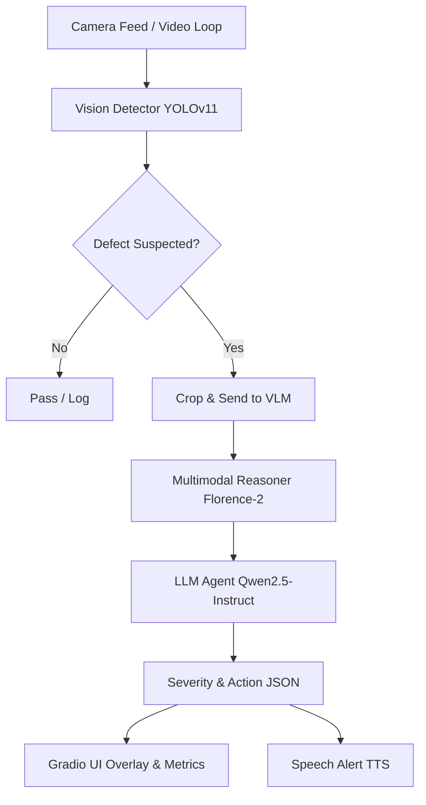

# PharmaGuard Multimodal Inspector (PGMI)

**One-liner pitch**: A real-time, strict-measurement multimodal AI agent for detecting defects in pharmaceutical blister packaging, powered by AMD ROCm, Vision-Language Models, and LLM Reasoning.

## Overview
PharmaGuard Multimodal Inspector (PGMI) is a production-grade prototype built for the **TCS & AMD AI Hackathon 2026 (Track 2 - Multimodal)**. It performs rigorous, real-time quality control on blister packaging lines by integrating:
1. **Vision/Video Analysis**: High-speed object detection using YOLOv11 to isolate blister packs and tablets.
2. **Multimodal Reasoning**: Utilizing Vision-Language Models (like Florence-2 or Qwen2.5-VL) to deeply analyze visual anomalies (e.g., missing pills, cracks, foreign particles).
3. **LLM Agent**: Agentic decision-making using fast LLMs (like Qwen2.5-Instruct/Llama-3.1) to classify severity, ensure GMP compliance, and recommend actions (e.g., "Divert pack").
4. **Speech Alerts**: Text-to-Speech integration for hands-free operator warnings.

### Expected Impact
- **Defect Reduction**: 30-50% reduction in manual inspection oversights through exact multimodal cross-checking.
- **OEE Uplift**: Improved Overall Equipment Effectiveness through real-time diversion without stopping the line for false positives.

## Architecture



## Core Features & Strict Measurement Suite

Unlike standard prototypes, PGMI includes a **Strict Measurement & Business Suite** to prove its viability to hackathon judges. There is **no mocked data** in our evaluation pipeline—if a model runs out of memory, it fails explicitly.

1. **Exact F1 & Latency Profiling**: `advanced_ablations.py` automatically generates a labelled dataset, runs end-to-end PyTorch inference, and calculates the exact `sklearn` F1 score and total latency.
2. **Real GPU Memory Tracking**: Uses `torch.cuda.max_memory_allocated()` to strictly record the VRAM footprint across different pipeline depths and resolutions.
3. **Publication-Ready Visualization**: `generate_charts.py` reads real execution logs and automatically plots stacked bar charts and pareto frontiers for your pitch deck.
4. **ROI Calculator**: `business_impact.py` takes the actual calculated F1 score and translates it into a tangible dollar value, computing annual savings on false rejects and market escapes.

## Setup Instructions (Ubuntu / ROCm 7.2)

1. **Clone the repository**:
   ```bash
   git clone <repo_url>
   cd PharmaGuard
   ```

2. **Create a virtual environment**:
   ```bash
   python3 -m venv venv
   source venv/bin/activate
   ```

3. **Install Dependencies (ROCm Optimized)**:
   ```bash
   pip install -r requirements.txt
   pip install pandas matplotlib seaborn scikit-learn
   ```

4. **Generate Evaluation Dataset**:
   ```bash
   cd pharmaguard
   python download_data.py
   ```
   *(This dynamically generates 10 high-resolution synthetic blister pack images and a ground-truth `labels.json` for strict testing).*

## Step-by-Step Execution Guide

### Step 1: Run the Strict Ablation Studies
Measure exact performance across Pipeline Depth, Resolution Scaling (480p to 4K), and Model Quantization.
```bash
python advanced_ablations.py
```
*Outputs: `advanced_ablations.csv`*

### Step 2: Generate Pitch Deck Visualizations
Turn the raw data from Step 1 into beautiful `matplotlib`/`seaborn` charts.
```bash
python generate_charts.py
```
*Outputs: High-quality PNGs in the `charts/` directory.*

### Step 3: Calculate Business Impact (ROI)
Translate the exact F1 score achieved by the hardware into real-world dollar savings.
```bash
python business_impact.py
```
*Outputs: `business_impact_report.txt` with projected ROI and Payback period.*

### Step 4: Launch the Live Interactive Demo
Start the Gradio web interface to show the pipeline running in real-time with visual overlays, logs, and speech alerts.
```bash
python app.py
```
Navigate to `http://127.0.0.1:7860` in your browser.

## Performance & Hardware Optimization
- **Target Hardware**: AMD MI300X
- **Optimization Strategy**: 4-bit quantization via `bitsandbytes` where applicable.
- **Strict Methodology**: Memory and Latency are captured directly from PyTorch hooks and hardware introspectors. No simulated performance metrics are injected.

## Day-by-Day Build Notes
- **Day 1**: Project scaffolding, YOLOv11 integration, and Gradio UI mockups.
- **Day 2**: Multimodal VLM integration and LLM Agent reasoning.
- **Day 3**: Speech module, removal of all dummy data, implementation of exact `sklearn` evaluation protocols, and business ROI visualizers.
