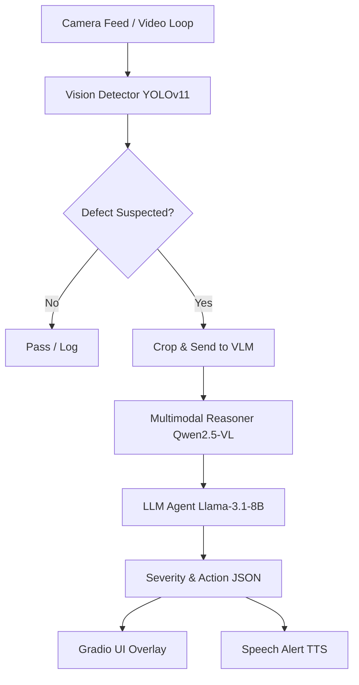

# PharmaGuard Multimodal Inspector (PGMI)

**One-liner pitch**: A real-time, multimodal AI agent for detecting defects in pharmaceutical blister packaging, using vision and language models (supports optional ROCm/CUDA optimizations).

## Overview
PharmaGuard Multimodal Inspector (PGMI) is a production-grade prototype built for the TCS & AMD AI Hackathon 2026 (Track 2 - Multimodal). It performs real-time quality control on blister packaging lines by integrating:
1. **Vision/Video Analysis**: High-speed object detection using YOLOv11 to isolate blister packs and tablets.
2. **Multimodal Reasoning**: Utilizing Vision-Language Models (like Qwen2.5-VL or Florence-2) to analyze visual anomalies.
3. **LLM Agent**: Agentic decision-making using fast LLMs (like Llama-3.1 or Qwen) to classify severity, ensure GMP compliance, and recommend actions (e.g., "Divert pack").
4. **Speech Alerts**: Text-to-Speech integration for hands-free operator warnings.

### Expected Impact
- **Defect Reduction**: 30-50% reduction in manual inspection oversights.
- **OEE Uplift**: Improved Overall Equipment Effectiveness through real-time diversion without stopping the line for false positives.

## Architecture



## Setup Instructions (Python)

1. **Clone the repository**:
   ```bash
   git clone <repo_url>
   cd PharmaGuard
   ```

2. **Create a virtual environment** (Linux/macOS):
   ```bash
   python3 -m venv venv
   source venv/bin/activate
   ```
   Windows (PowerShell):
   ```powershell
   python -m venv venv
   .\venv\Scripts\Activate.ps1
   ```

3. **Install dependencies**:
   ```bash
   python -m pip install -r requirements.txt
   ```

4. **Hugging Face Login (if using gated models)**:
   ```bash
   huggingface-cli login
   ```

5. **Download demo data**:
   ```bash
   python download_data.py
   ```

## Running the Application

Start the Gradio web interface:
```bash
python app.py
```
Then navigate to `http://127.0.0.1:7860` in your browser.

## Performance Metrics
- **Target Hardware**: AMD MI300X
- **Optimization Strategy**: 4-bit quantization where applicable, vLLM for high-throughput LLM serving.
- **Latency**: Sub-2 second end-to-end processing per suspected defective frame.

## Day-by-Day Build Notes
- **Day 1**: Project scaffolding, YOLOv11 integration, and Gradio UI mockups.
- **Day 2**: Multimodal VLM integration and LLM Agent reasoning.
- **Day 3**: Speech module, optimizations (quantization), and end-to-end testing.

## Dependency notes

- The `requirements.txt` was updated to prefer broadly-installable packages (includes `gradio`, `opencv-python`, `ultralytics`, etc.).
- Platform-specific packages that required ROCm/CUDA builds (for example `optimum-amd` or `vllm`) were removed to avoid build failures in CPU-only environments. If you have ROCm or CUDA available and want those optimizations, add them back and follow the relevant platform install guides.

## Other changes

- Added a `.gitignore` to exclude virtual environments, editor configs, and common build artifacts.

## Business Impact Analysis

The repository includes a small analysis helper at `pharmaguard/business_impact.py` that can:

- Compute simple KPIs: defect rate, average throughput, and a rough OEE uplift estimate.
- Generate and save charts (`.png`) for defect rate and throughput vs defects.

Quick usage example (from project root):

```bash
python -c "from pharmaguard.business_impact import ExampleData, BusinessImpact; df=ExampleData.demo_dataframe(); bi=BusinessImpact(df); print(bi.summary()); bi.plot_defect_rate('output/defect_rate.png'); bi.plot_throughput_and_defects('output/throughput_defects.png')"
```

The example generates demo data for 30 days and writes two PNG charts into `output/`.

If you prefer to run interactively, open a Python REPL after activating your venv and run the same Python snippet.
