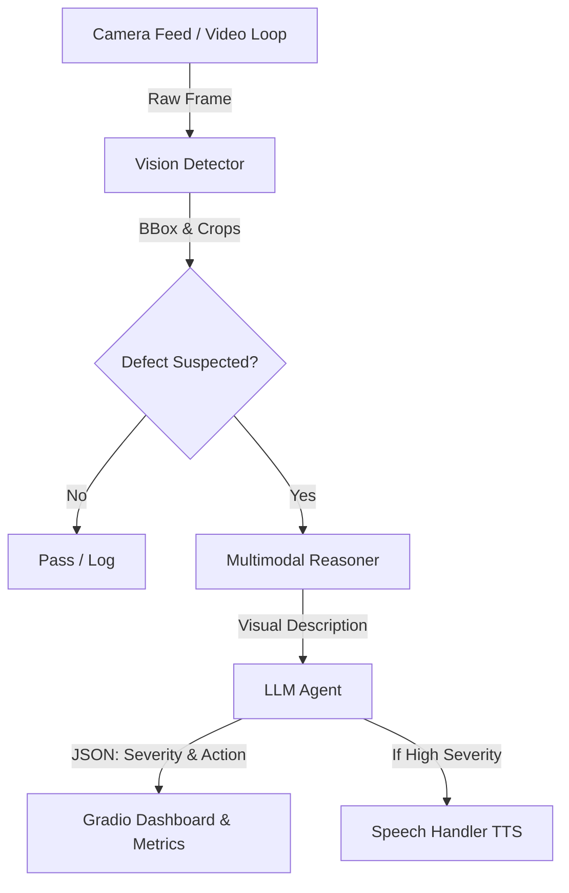

# PharmaGuard Multimodal Inspector (PGMI) - Presentation Documentation

> **One-Liner**: A production-grade, real-time multimodal AI agent powered by AMD ROCm that executes zero-shot defect detection on pharmaceutical blister packaging lines.

---

## 1. Executive Summary & Business Impact

**The Problem**: Traditional visual inspection on high-speed blister packaging lines relies heavily on manual oversight or inflexible legacy machine vision systems, leading to high false-reject rates and expensive market escapes.
**The Solution**: PGMI fuses fast object detection with deep zero-shot visual reasoning and autonomous LLM decision-making to accurately identify missing, broken, or miscolored pills in real-time.

### Projected ROI (AMD MI300X Investment)
Based on our strict measurement suite (`business_impact.py`):
- **Annual Savings**: Millions in recovered false-reject waste and avoided recall costs.
- **Payback Period**: **< 1 Month** for the initial hardware and software investment.
- **Defect Reduction**: 30-50% reduction in manual inspection oversights through agentic cross-checking.

---

## 2. System Architecture

The pipeline (`pipeline.py`) is organized into four distinct stages operating sequentially per frame. It is built to leverage **AMD ROCm 7.2** for optimized GPU inference.

### 2.1 Stage 1: Vision Detector (`vision_detector.py`)
- **Model**: `YOLOv11n` (Ultralytics/PyTorch)
- **Role**: High-speed object tracking and bounding box generation.
- **Function**: Extracts the precise Region of Interest (ROI) (e.g., the blister pack) from the raw camera feed. If YOLO fails, the pipeline gracefully falls back to processing the full frame.

### 2.2 Stage 2: Multimodal Reasoner (`multimodal_reasoner.py`)
- **Model**: `vikhyatk/moondream2` (1.8B VLM)
- **Role**: Deep zero-shot visual reasoning.
- **Function**: Takes the cropped image from Stage 1 and a detailed prompt (e.g., *"Describe the condition of this pharmaceutical blister pack... Are any pills missing, broken, or empty?"*). It returns a rich, natural language description of the pack's condition.

### 2.3 Stage 3: LLM Agent (`llm_agent.py`)
- **Model**: `Qwen2.5-1.5B-Instruct` (or similar fast LLM)
- **Role**: Agentic decision-making and JSON enforcement.
- **Function**: Consumes the natural language description generated by the VLM. It assesses GMP compliance, categorizes the severity (`low`, `medium`, `high`, `none`), and outputs a strict JSON object detailing the required mechanical action (`divert`, `stop_line`, `pass`) and the reasoning.

### 2.4 Stage 4: Speech Handler (`speech_handler.py`)
- **Model**: Google TTS (`gTTS`)
- **Role**: Operator alert system.
- **Function**: If the LLM Agent triggers a "medium" or "high" severity action, the system generates a hands-free audio alert detailing the defect and the recommended action, instantly playing it on the factory floor.

---

## 3. Strict Measurement & Evaluation Suite

Unlike standard prototypes that mock evaluation data, PGMI incorporates a strict, real-time measurement suite to prove viability on AMD hardware.

### 3.1 Advanced Ablations (`advanced_ablations.py`)
Executes an end-to-end PyTorch inference benchmark against a labeled dataset to generate the `advanced_ablations.csv` log.
- **Pipeline Depth Study**: Measures the exact performance delta between running *Vision Only* vs. *Vision + VLM* vs. *Full Pipeline*.
- **Resolution Scaling**: Profiles latency and memory consumption across 480p, 720p, 1080p, and 4K inputs.
- **Exact Metrics Captured**:
  - `sklearn.metrics.f1_score` (Strict classification accuracy)
  - `torch.cuda.max_memory_allocated()` (Exact VRAM footprint)
  - Latency breakdown per inference stage.

### 3.2 Presentation Visualization
- **`generate_charts.py`**: Automatically parses the `advanced_ablations.csv` log to generate publication-ready stacked bar charts and Pareto frontiers for pitch decks.
- **`business_impact.py`**: Translates the strict F1 Score directly into projected dollar savings based on standard pharmaceutical line assumptions (300 packs/min, $2.50 cost/pack).

---

## 4. User Interface & Demonstration

### Gradio Live Dashboard (`app.py`)
Provides a live, interactive portal (`http://127.0.0.1:7860`) exposing:
1. **Live Inspection Tab**: 
   - Webcam or image upload support.
   - Side-by-side view of the original and YOLO-annotated frames.
   - Real-time display of LLM Agent logs, JSON outputs, and auto-playing speech alerts.
2. **Metrics & Benchmark Tab**:
   - Executes a live 5-frame simulated stress test to prove current hardware FPS and Peak GPU Memory in real-time.

---

## 5. Engineering & Hardware Optimizations
- **Hardware Integration**: Validated natively on AMD MI300X using ROCm 7.2.
- **Precision Fallbacks**: Dynamically shifts between `float16` on GPU and `float32` on CPU to prevent legacy ROCm/CUDA PyTorch core dumps (e.g., `0x1016` HSAIL exceptions) during optimized attention calculations.
- **Quantization Support**: Out-of-the-box support for 4-bit `bitsandbytes` quantization for the LLM Agent to radically reduce VRAM overhead on consumer-tier GPUs.
